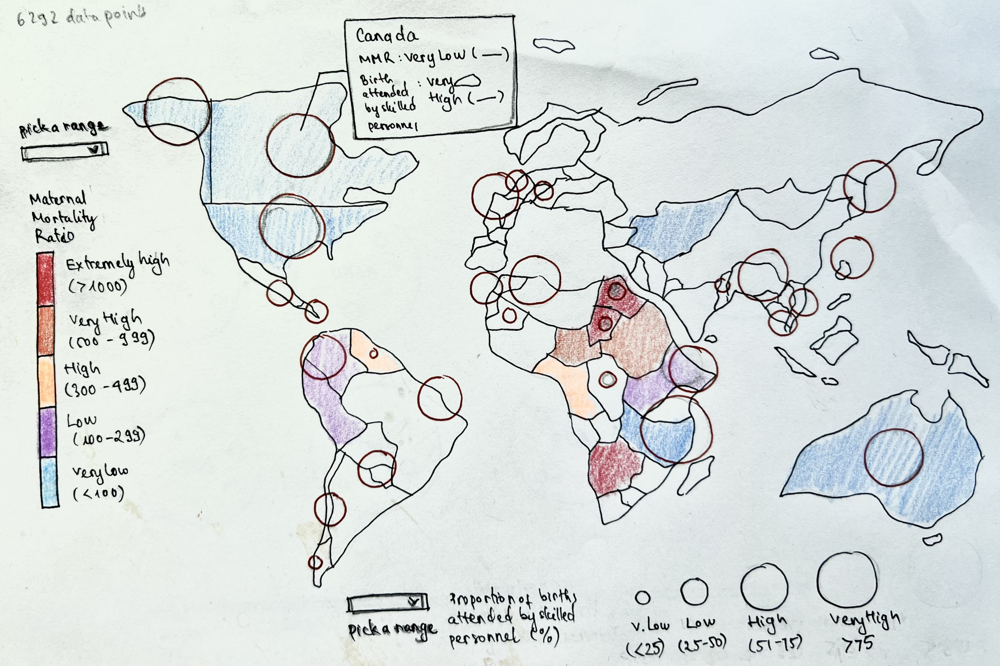
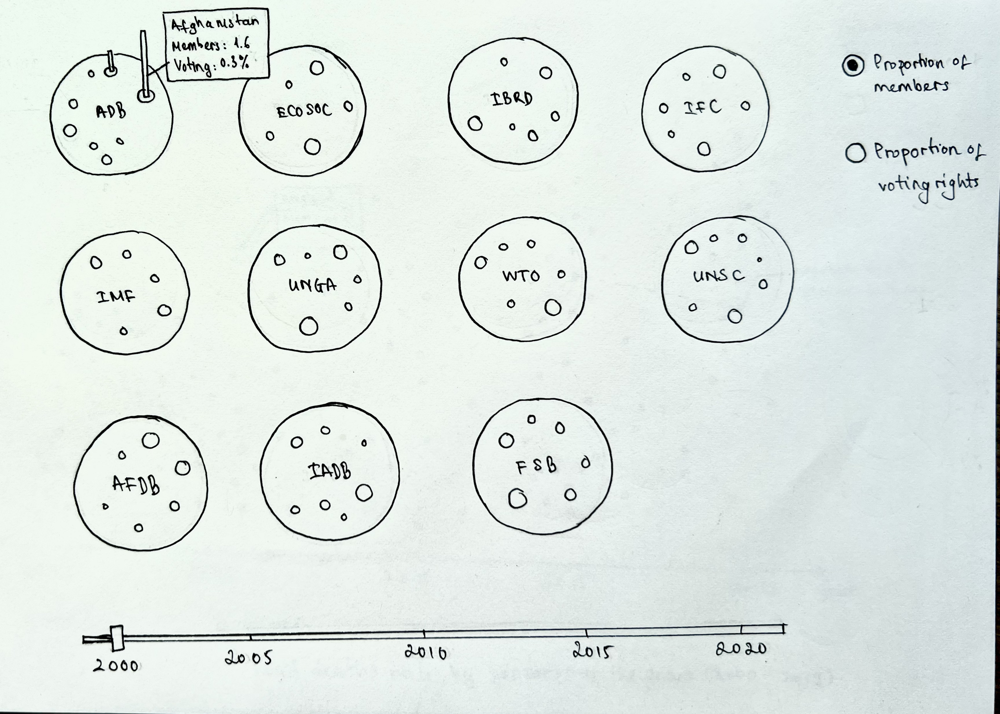
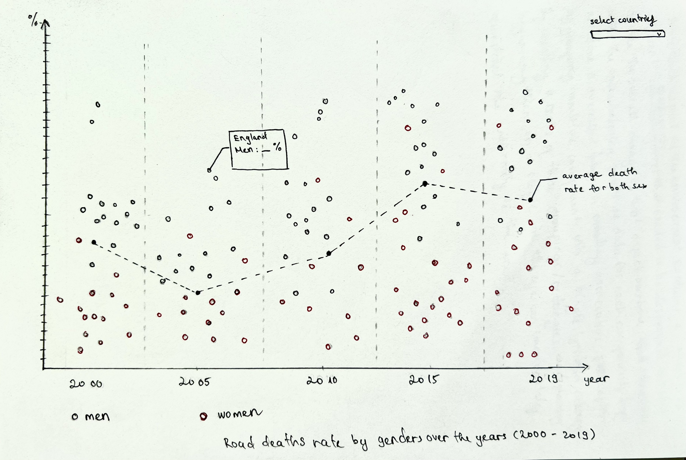

Concept 1: 

The tittle of this visualization is "The correlation between numbers of skilled health personnel are needed and maternal mortality ratio in Developing Countries". Through this visualization, I want to explore if the correlation between these two data sets is positive or negative. Would higher numbers of skilled health personnel lead to higher to lower maternal mortality ratio? Another question I want to raise for the audience (especially governors) is which countries are doing a better job at lowering the maternal mortality ratio? What can be learned from these countries' policies to improve maternal health and prevent deaths? The data is pulled from the data portal provided by the United Nations (UN), indicator 3.1.1 and 3.1.2. Indicator 3.1.1 records data on maternal mortality ratio, and indicator 3.1.2 records data on  proportion of births attended by skilled health personnel (%). There are 6315 data points in total, 4140 for indicator 3.1.1, and 2175 for indicator 3.1.2. The data is very dense and consistent for 3.1.1, but it's not up-to-date as the latest data were recorded in 2017. In contrast, data is quite up-to-date for 3.1.2 with data in 2021, but it is quite sparse and inconsistent over the years as there are a lot of information missing for certain years in certain countries. I used the spatial visualization method as I am comparing a large number of countries and comparing their data. It would be more effective and easier for the audience to look at something as familiar as the world map. Rather than creating a list of country names, using such a widespread and standard rendition of the world map would simplify the visualization.

Concept 2:

This visualization is named "Are developing countries getting their equal right in decision-making in international organizations?". With this visualization, I want to know if developing countries are getting more or less representations and voting rights over the years. In other words, this visualization puts the 10.6 goal into a test to see if representations and voting rights for developing countries are really getting enhanced or not. This visualization will also show how many countries are seeing an upward trend in equality by using year slider and observing how the size of circles representing proportion of members shift every five years. Another exploration I want to have with this visualization is whether the number of members within an organization would increase that countries' voting rights. Glancing through the data, there might be some interesting discoveries since some countries have higher proportion of members, but less voting rights than other countries. I am interested to learn what might be the determinator of how much voting rights a member has. The data for this visualization is pulled from indicator 10.6.1 from goal 6. There are 19580 data points for all developing countries. As for the quality of the data, it's hard to check the accuracy of the data since only 2 organizations that have an accessible source for their data. For the completeness, data is quite sparse between 2000 and 2014. The data is pretty consistent all throughout 2 data sets (global monitoring data). However, the latest data points were collected in 2020, so it cannot be used for real-time reporting. I used circle packing and bar graph visualization methods to stack 2 different data sets. I chose circle packing for the proportion of members in an organization because I want to show how different countries's proportion of members vary and their hierarchical structures. I also want to show the relationship between the proportion of voting rights with the proportion of members, so I stacked them on top of each other to easily see if the correlation is positive or negative. 

Concept 3:

The tittle of this visualization is "Do men or women have a higher death rate due to road traffic injuries?'. The questions I want to ask with this visualization is: What is the comparison between men's and women's death rates from road traffic injuries? Does genders have anything to do with road traffic related deaths? And what are the trends over the years? Is death rates in each gender increasing or decreasing in each country in general? The data for this visualization is pulled from indicator 3.6.1 in goal 3. There are 2865 data points in total. As for the data quality, the data types are not very consistent (some are estimated data, some are global monitoring, etc.). However, the data is complete in each gender and each country (collected every 4-5 years). This data set is not very up-to-date since the latest year was 2019. I used scatter plot for this visualization since I want to see the relationship between gender and traffic injuries death, and there seem to be enough data to see determine whether the relationship is strong or weak. 
